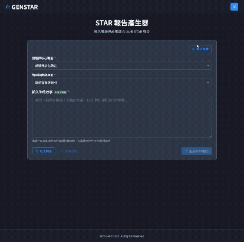

# STAR 報告產生器

一個功能完善的 STAR 報告生成和管理工具，幫助零售服務業員工創建、儲存和優化專業的工作成果展示。



## 功能特色

- **現況與職能管理**：設定核心職能並生成相對應的 STAR 報告
- **AI 驅動生成**：使用 OpenAI API 自動將故事轉換為結構化報告
- **報告儲存**：生成的 STAR 報告可儲存至 MongoDB 數據庫
- **回顧與再利用**：載入先前的報告或範例模板以節省時間
- **分類導向**：針對不同商店類別客製化內容與專業術語
- **即時反饋**：字數統計和實時預覽功能
- **清晰視覺化**：結構化呈現 STAR 各元素 (情境、任務、行動、結果)
- **本地及雲端部署**：支援本地開發環境和 Render 雲端部署

## 技術棧

### 前端
- **React 18**：使用最新的 React 框架
- **Chakra UI**：現代化、美觀的 UI 組件庫
- **React Icons**：提供豐富的圖標資源
- **axios**：處理 HTTP 請求

### 後端
- **Express.js**：輕量級 Node.js Web 應用框架
- **MongoDB**：使用 Mongoose ODM 的 NoSQL 數據庫
- **OpenAI API**：驅動 STAR 報告生成功能
- **cors**：跨源資源共享中間件

## 安裝與設定

### 前提條件
- Node.js (>=14.x)
- npm 或 yarn
- MongoDB 資料庫 (本地或雲端如 MongoDB Atlas)
- OpenAI API 密鑰

### 安裝步驟

1. 複製專案
```bash
git clone https://github.com/yourusername/star-generator.git
cd star-generator
```

2. 安裝依賴
```bash
npm install
```

3. 設定環境變數
建立 `.env` 檔案，參考 `.env.example` 檔案內容

```
REACT_APP_API_URL=http://localhost:5000
MONGODB_URI=your_mongodb_connection_string
OPENAI_API_KEY=your_openai_api_key
```

4. 啟動應用
```bash
# 開發模式 (同時啟動前端和後端)
npm run dev

# 僅啟動前端
npm start

# 僅啟動後端
npm run server
```

## 使用指南

### 生成 STAR 報告
1. 選擇核心職能和商店類別
2. 輸入職場故事（或使用範例模板）
3. 點擊「生成 STAR 報告」按鈕
4. 系統將自動生成並顯示結構化的 STAR 報告

### 載入與儲存報告
- 使用「儲存」按鈕將當前報告保存到數據庫
- 使用「載入報告」按鈕從數據庫中載入已保存的報告

### 清除內容
- 點擊「清除內容」按鈕僅清除故事文本，保留類別和職能選擇
- 點擊「創建新報告」按鈕可完全重置並開始新報告

### 複製功能
- 點擊報告右上角的複製按鈕，一鍵複製整個報告
- 報告可直接貼上到工作評估文件或郵件中

## 部署指南

### Render 部署
1. 在 Render 上創建一個新的 Web Service
2. 連接您的 GitHub 存儲庫
3. 設定環境變數 (MONGODB_URI, OPENAI_API_KEY)
4. 設定構建命令: `npm install && npm run build`
5. 設定啟動命令: `npm run render-start`

## 目錄結構

```
/
├── client/               # 前端 React 程式碼
│   ├── src/              # 源代碼
│   │   ├── components/   # React 元件
│   │   ├── utils/        # 工具函數
│   │   ├── App.js        # 應用程式主元件
│   │   └── index.js      # 程式進入點
├── server/               # 後端 Express 程式碼
│   ├── src/              # 源代碼
│   │   ├── config/       # 配置文件
│   │   ├── controllers/  # 控制器
│   │   ├── models/       # 數據模型
│   │   ├── routes/       # API 路由
│   │   └── utils/        # 工具函數
├── .env                  # 環境變數
└── package.json          # 專案依賴
```

## 開發者說明

- 使用 ESLint 和 Prettier 確保代碼質量
- 添加新功能時，請確保同時更新相關的單元測試
- 定期運行 `npm run test` 確保功能正常
- 分支命名規範：`feature/feature-name` 或 `bugfix/bug-name`

## API 端點

| 端點 | 方法 | 描述 |
|------|------|------|
| `/api/generate` | POST | 生成 STAR 報告 |
| `/api/reports` | GET | 獲取所有報告 |
| `/api/reports/:id` | GET | 獲取特定報告詳情 |
| `/api/reports` | POST | 創建新報告 |
| `/api/reports/:id` | PUT | 更新特定報告 |
| `/api/reports/:id` | DELETE | 刪除特定報告 |
| `/api/health` | GET | API 健康狀態檢查 |

## 貢獻指南

1. Fork 此存儲庫
2. 創建您的功能分支 (`git checkout -b feature/amazing-feature`)
3. 提交您的變更 (`git commit -m 'Add some amazing feature'`)
4. 推送到分支 (`git push origin feature/amazing-feature`)
5. 創建新的 Pull Request

## 許可證

本專案使用 MIT 許可證 - 詳見 [LICENSE](LICENSE) 檔案

## 聯絡方式

GitHub Issues: https://github.com/yourusername/star-generator-v2/issues

Email: ouhsiu1993@gmail.com